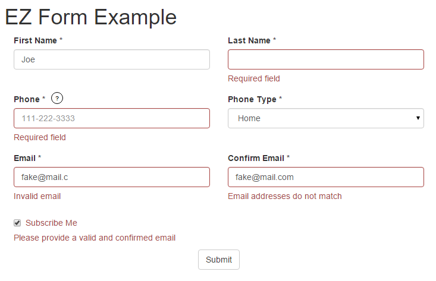

React EZ Form Component
=======================

##Description
A React component for creating dynamic Bootstrap forms by passing a simple declarative model to its props.
Includes validation, a single onFormChange event, immutable data, straightforward hooks for customization, and
responsive column layouts.

This is not a general purpose form solution. There are obvious limitations, but it can save time for specific use cases.
The entire component is implemented in the [EZForm.js](./src/components/EZForm.js) file, which has no dependencies other
than react. So it's easy to copy and modify for other use cases.

Please keep in mind that this project was thrown together in one day, so refactoring, optimization, and testing would
all be nice enhancements before using the code in production.

##Setup
To run the example, enter the following in your command prompt, opened at the root of the project. (Windows users
can leave off the $). If you're running Windows 10 and get build errors, ensure that your environment is setup correctly
with these instructions:
[Configuring Windows 10 (64-bit) for npm and node-gyp](https://gist.github.com/jtrefry/fd0ea70a89e2c3b7779c).
If you're running Windows 8 or below, then carefully following the
[installation instructions for node-gyp](https://www.npmjs.com/package/node-gyp) will likely solve your issues.

```
$ npm install
$ npm start
```

Then open [http://localhost:4000](http://localhost:4000). You should see this example: .

Then, if you open your browser's developer tools, and watch the console as you enter data into the form, you will see
the new form data logged for every change - including single keystrokes.

##Build
To build the project run the following command:

```
$ npm run build
```

This will create a new dist/js/bundle.js file. Notice that react, react-dom and react-bootstrap are excluded from
bundle.js. Instead, they are added to dist/index.html as external script tags.

##Declaring Fields
React EZ Form lets you build a form by simply declaring the fields and their behaviors.
Anytime something changes in the form, the onFormChange prop will be called with the new (immutable) form data.

Here are the fields used in the example above. Note that custom tooltip rendering is provided for the 'phone' field. The
React EZ Form component does not implement tooltips because it would require additional dependencies such as react-bootstrap.
It does provide the render hook though, so you can render anything you want from your app.

```javascript
import React from 'react';
import { OverlayTrigger, Tooltip } from 'react-bootstrap';
import regexValidators from './regex-validators';

const contactFormFields = [
    {
        name: "firstName",
        type: "string",
        label: { text: "First Name *" },
        validators: [{
            validate: data => data.firstName.length > 0,
            message: "Required field"
        }]
    }, {
        name: "lastName",
        type: "string",
        label: { text: "Last Name *" },
        validators: [{
            validate: data => data.lastName.length > 0,
            message: "Required field"
        }]
    }, {
        name: "phone",
        type: "string",
        label: {
            text: "Phone *"
        },
        tooltip: {
          render: data => (
              <OverlayTrigger overlay={<Tooltip id="phoneTooltip">US 10 digit phone number</Tooltip>} placement="top" delayShow={150} delayHide={150}>
                  <span className="tooltip-icon">?</span>
              </OverlayTrigger>
          )
        },
        control: {
            attributes: {
                placeholder: "111-222-3333"
            }
        },
        validators: [{
            validate: data => (data.phone.length > 0),
            message: "Required field"
        }, {
            validate: data => (data.phone.length == 0 || regexValidators.phone.test(data.phone)),
            message: "Invalid phone number"
        }]
    }, {
        name: "phoneType",
        type: "number",
        label: { text: "Phone Type *" },
        control: {
            tag: "select",
            options: [
                { id: -1, text: "Select..."},
                { id: 1, text: "Home" },
                { id: 2, text: "Work" },
                { id: 3, text: "Cell" },
                { id: 4, text: "Other" }
            ]
        },
        validators: [{
            validate: data => (data.phoneType || -1) > -1,
            message: "Required field"
        }]
    }, {
        name: "email",
        type: "string",
        label: { text: "Email *" },
        control: {
            attributes: {
                placeholder: "someone@mail.com"
            }
        },
        validators: [{
            validate: data => (data.email.length > 0),
            message: "Field required"
        },{
            //don't show this msg if the field is empty since required field message will already show
            validate: data => ((data.email.length === 0) || (regexValidators.email.test(data.email))),
            message: "Invalid email"
        }],
        dependentFields: ["confirmEmail", "subscribeMe"]
    }, {
        name: "confirmEmail",
        type: "string",
        label: { text: "Confirm Email *" },
        control: {
            attributes: {
                placeholder: "someone@mail.com"
            }
        },
        validators: [{
            validate: d => ((d.email.length === 0) || (d.confirmEmail.length > 0)),
            message: "Field required"
        },{
            validate: d => ((d.email.length === 0) || (d.confirmEmail.length === 0) || (d.confirmEmail.toLowerCase() === d.email.toLowerCase())),
            message: "Email addresses do not match"
        }],
        dependentFields: ["email", "subscribeMe"]
    }, {
        name: "subscribeMe",
        type: "boolean",
        label: {
            text: "Subscribe Me"
        },
        validators: [{
            validate: d => (d.subscribeMe === false || (d.email.length > 0 & d.confirmEmail.toLowerCase() === d.email.toLowerCase())),
            message: "Please provide a valid and confirmed email"
        }],
        dependentFields: ["email", "confirmEmail"]
    }
];

export default contactFormFields;
```

##PropTypes and Documentation
Here are the React PropTypes (aliased with 't') specified in the [EZForm.js](./src/components/EZForm.js) component:

```javascript
import React, { PropTypes as t } from 'react';

EZForm.propTypes = {
    /** A hash of name value pairs bound to the form. The names must match the field names passed to the 'fields' prop.
     *  Nested objects are not supported at this time, but they could be implemented by rending nested EZForm components. */
    data: t.object.isRequired,
    /** A function accepting the new (immutable) form data that is called for any change (including a single keystroke). */
    onFormChange: t.func.isRequired,
    /** A list of fields and their settings to determine how they should render and validate. */
    fields: t.arrayOf(t.shape({
        /** The field's name must match the name of a property on the 'data' object passed to the EZForm component. */
        name: t.string.isRequired,
        type: t.oneOf(['string', 'number', 'boolean', 'object']).isRequired,
        label: t.shape({
            /** The inner text of the label to be displayed on the form.
             *  If not specified, the field name will be displayed in brackets */
            text: t.string,
            /** 'inline' applies the Bootstrap 'form-inline' class to the div surrounding the 'form-group', so the label
             *  appears on the left if there is enough space. */
            placement: t.oneOf([/*default*/ 'top', 'inline']),
            /** A hash of any valid React element attributes. These will get applied to the label element, merging with,
             *  and overriding any attributes created by EZForm during rendering. */
            attributes: t.object,
            /** A custom function for rending the label (ignored for checkbox controls), accepting parameters:
             *  1.) an object containing the current form data
             *  2.) the name of the field getting validated */
            render: t.func
        }),
        div: t.shape({
            /** A hash of any valid React element attributes. These will get applied to the div element that contains
             *  the Bootstrap form-group which wraps the label and input control. These will merge with and override
             *  any attributes created by EZForm during rendering. */
           attributes: t.object
        }),
        tooltip: t.shape({
            /** A custom function for rending the tooltip. */
            render: t.func
        }),
        control: t.shape({
            /** The tag name of the HTML element.
             *  Buttons are not supported, since they should be implemented by the parent component that hosts the form.
             *  A button should call the validateAll method of the form, and only continue if it returns true.
             *  A button could do this for multiple forms, or multiple instances of the same form, treating them like
             *  a single logical form. */
            tag: t.oneOf(['input', 'select']),
            /** The data to populate a 'select' control's options. If the tag is 'select', these are required,
             *  but there is no way to express that with PropTypes. */
            options: t.arrayOf(t.shape({
                id: t.oneOfType([t.number, t.string]),
                text: t.string })
            ),
            /** A hash of any valid React element attributes. These will get applied to the control element, merging
             *  with, and overriding any attributes created by EZForm during rendering. */
            attributes: t.object,
            /** A custom function for rending the control (ignored for checkbox controls), accepting parameters:
             *  1.) an object containing the current form data
             *  2.) the name of the field getting validated */
            render: t.func
        }),
        validators: t.arrayOf(t.shape({
            /** A function accepting parameters:
             *  1.) an object containing the new form data
             *  2.) the name of the field getting validated
             *  The form data is provided for cross-validation checks. If other fields should be validated together
             *  add them to the dependentFields array below. */
            validate: t.func,
            message: t.string })
        ),
        /** An array of other field names that should have their validators called with this field. */
        dependentFields: t.array
    })).isRequired
```

##CSS for Variable Height Rows
Also, take a look at [main.css](./dist/css/main.css). The media queries clear left for every 5th div (field) on large
screens, and every 3rd div (field) on medium screens. This creates a 4 column layout for large screens, a 2 column
layout for medium screens, and a 1 column layout for small screens. It also solves a problem with variable height rows
as explained in the CSS comments.

If you want a different layout, you can modify the media queries and/or clear divs (fields) as needed using the
field.div.attributes hash. (See comments in the PropTypes above).

##HTML
The React EZ Form component renders a form element containing 'column' divs for each field. 'Row' divs
are not used, allowing for a more responsive layout. Check out the 'renderField' function if you want different
rendering logic.

In the example below, the field validators for firstName all returned true, so the error messages are not displayed.
One of the field validators (the only one actually) for lastName returned false, so the error message is displayed
and the has-error class is added next to form-group.
(Note that checkboxes have a slightly different layout by necessity.)

```html
<form className="variable-height-rows">

  <div class="col-sm-6 col-md-3">
    <div class="form-group">
      <label for="firstName_control" class="form-label">
        First Name *
      </label>
      <input type="text" id="firstName_control" class="form-control" value="Pocahontas" />
      <div class="help-block" style="display: none">
      </div>
    </div>
  </div>

  <div class="col-sm-6 col-md-3">
    <div class="form-group has-error">
      <label for="lastName_control" class="form-label">
        Last Name *
      </label>
      <input type="text" id="lastName_control" class="form-control" value="" />
      <div class="help-block" style="display: none">
         Required Field
      </div>
    </div>
  </div>

</form>
```

##Using the React EZ Form
It makes sense to define fields in their own module (js file), and then import them wherever you have a form that
needs them. Here is the [App.js](./src/App.js) file doing exactly that:

```jsx
import React, { Component } from 'react';
import EZForm from './components/EZForm';
import contactFormFields from './examples/contact-form-fields';

export default class App extends Component {

    constructor(props) {
        super(props);

        //initial state
        this.state = {
            contact: {
                //these must map to the field names
                firstName: "",
                lastName: "",
                phone: "",
                phoneType: -1,
                email: "",
                confirmEmail: "",
                subscribeMe: false
            }
        }
    }

    handleFormChanged(newFormData) {
        console.log(newFormData);
        this.setState({contact: newFormData});
    }

    handleSubmit(e) {
        e.preventDefault();

        if (this.refs.contactForm.validateAll()) {
            alert('Validation passed');
        }
    }

    render() {
        return <div className="container" style={{ marginTop: "20px" }}>
            <h1>EZ Form Example</h1>
            <EZForm ref="contactForm" fields={contactFormFields}
                         data={this.state.contact}
                         fields={contactFormFields}
                         onFormChange={this.handleFormChanged.bind(this)} />

            <div className="row">
                <div className="col-sm-12 text-center">
                    <input type="submit" className="btn btn-default" value="Submit" onClick={this.handleSubmit.bind(this)} />
                </div>
            </div>
        </div>
    }
}
```

##A Final Note

If you have a project that uses Redux, it would be trivial to modify the component to use Redux state instead of
internal state. This is not the default, because it would create a dependency that wouldn't make sense for some
projects.